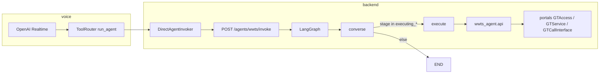
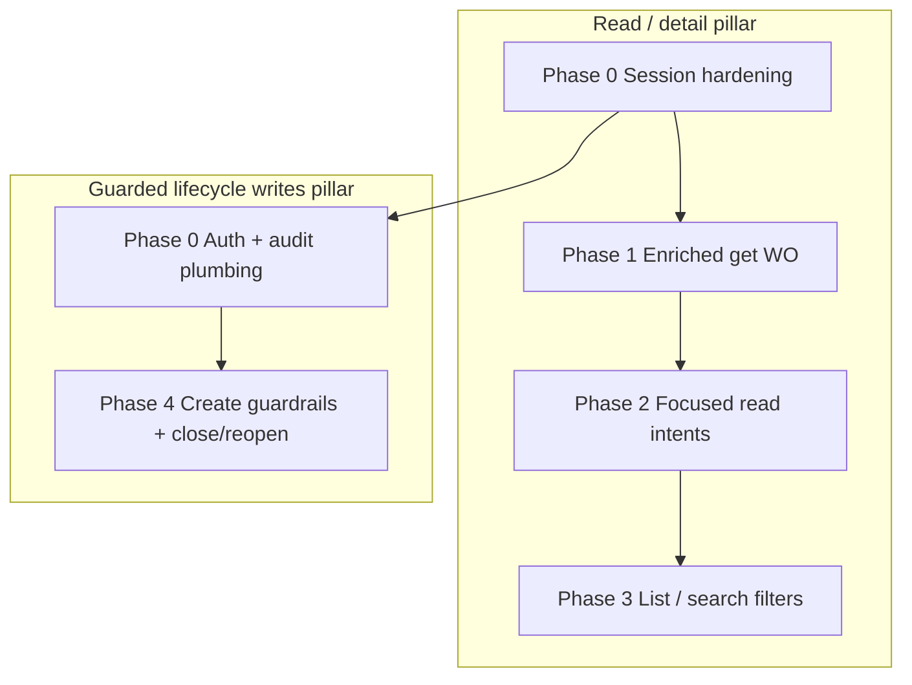

# L1 WWTS Support Agent — Integration Plan

**Workspace:** `d:\real-time-voice`  
**Sources:** `wwts-agent/`, `server/auth.py`, `voice-wrapper/`, and installed `portals` package (git dep `https://git.wwts.com/bots/portals.git` — typically under `server/new/Lib/site-packages/portals/` when the server venv is built).

**Note:** `portals/wwits/groups/` is not vendored in this git repo; it ships inside the `portals` Python package. API behavior is defined by `portals.wwits.apis.rest_services` plus per-module Marshmallow schemas under `groups/`.

---

## Executive summary — two equal pillars

L1 WWTS is intentionally **bimodal**:

| Pillar | Flows | Priority |
|--------|--------|----------|
| **Read / detail** | List, search, get WO, parts, labor, site, remarks, session context | Equal |
| **Guarded lifecycle writes** | Create WO, close WO, reopen WO | Equal |

Do **not** treat create as optional, out of scope, or “Phase 5 removal.” Do **not** default-block close/reopen — implement them with explicit guardrails (confirmation, scope, authorization, audit). Arbitrary field updates, cancel, and unscoped batch writes remain blocked.

---

## 1. Current `wwts-agent` capabilities (implementation baseline)

### Architecture

| Component | Role |
|-----------|------|
| `wwts-agent/wwts_agent/graph.py` | Two-node graph: `converse` → (`execute` \| END) → END. Checkpoint: `MemorySaver`. Executing stages: `executing_list`, `executing_get`, `executing_create`. |
| `wwts-agent/wwts_agent/state.py` | FSM stages; intents `list_wo`, `get_wo`, `create_wo`; `create_fields`, `wo_number`, `context` (`wwts_session`, `customer_codes`). |
| `wwts-agent/wwts_agent/nodes/converse.py` | OpenAI JSON routing + keyword fallback; create field validation (`_REQUIRED_CREATE`, site vs city/state/zip). |
| `wwts-agent/wwts_agent/nodes/execute.py` | `list_workorders`, `get_workorder`, `create_workorder`. |
| `wwts-agent/wwts_agent/api.py` | Wrappers → `GTService` / `GTCallInterface`; create via `request_for_open`. |
| `wwts-agent/routes/wwts_agent.py` | `POST /agents/wwts/invoke` — omits `messages` on invoke (checkpoint preserves history). |
| `server/auth.py` | `POST /gtaccess/login` → `start_session` + `UserCustomers`. |

### Implemented today

| Intent | Stage | Portal API(s) | Notes |
|--------|-------|---------------|-------|
| `list_wo` | `executing_list` | `GTService.QueryCustomerOrders` | Per `customer_codes`; `wo_status` O/C/A; `wo_days_back` |
| `get_wo` | `executing_get` | `GetCallDetailV3` + `GetCallRemarks` | Last 10 remarks in answer |
| `create_wo` | `collecting_create` → `executing_create` | `GTCallInterface.request_for_open` | Field map in `_map_create_fields`; address retry loop |

### Gaps (planned in this document)

**Read pillar:** parts, labor, site, enriched speak, WO customer-scope check, session `FunctionAuthorizeList` / `GetUserInfo`.

**Write pillar:** explicit confirmation + audit for create; **new** `close_wo` / `reopen_wo` intents and `GTServiceAction` wrappers; idempotency and “already closed/open” guards.

---

## 2. Portal API catalog (reference)

### 2.1 Access (`GTAccess`)

| Module | Method | HTTP | Type | Purpose |
|--------|--------|------|------|---------|
| `session_start` | `start_session` | GET | Auth | Open session |
| `user_customers` | `UserCustomers` | GET | Read | Customer codes (used at login) |
| `user_info` | `GetUserInfo` | GET | Read | Profile / `UserType` |
| `function_authorize_list` | `FunctionAuthorizeList` | GET | Read | Authorized function names |
| `user_vendors` | `GetUserVendorInfo` | GET | Read | Vendor associations |

### 2.2 Batch (`GTCallInterface`)

| Module | Method | HTTP | L1 policy |
|--------|--------|------|-----------|
| `request_for_open` | `request_for_open` | PUT | **ALLOWED WITH GUARDRAILS** (create — implemented) |
| `request_for_part` | `request_for_part` | PUT | **BLOCKED** (L1) |
| `remark_new` | `remark_new` | PUT | **BLOCKED** unless separately scoped |
| `cancel_wo` | `cancel_wo` | PUT | **BLOCKED** (always L1) |

### 2.3 Service reads (`GTService`)

| Module | Method | HTTP | L1 policy |
|--------|--------|------|-----------|
| `wo_customer` | `QueryCustomerOrders` | PUT* | **ALLOWED** (list — implemented) |
| `wo_detail` | `GetCallDetailV3` | GET | **ALLOWED** (get — implemented) |
| `wo_remarks` | `GetCallRemarks` | GET | **ALLOWED** |
| `wo_parts` | `GetCallParts` | GET | **ALLOWED** (Phase 1) |
| `wo_part_line` | `GetCallPartDetail` | GET | **ALLOWED** |
| `wo_labor` | `QueryLaborItems` | GET | **ALLOWED** |
| `wo_labor_activities` | `QueryLaborActivities` | GET | **ALLOWED** |
| `wo_labor_activity` | `GetLaborActivity` | GET | **ALLOWED** |
| `site_details` | `GetSiteDetail` | GET | **ALLOWED** |

\*Semantically read; HTTP PUT with `Parms` JSON.

### 2.4 Service mutations (`GTService` — general)

| Module | Method | HTTP | L1 policy |
|--------|--------|------|-----------|
| `wo_insert_remark` | `InsertCallRemark` | POST | **BLOCKED** default; optional Phase 6 with same guardrails as writes |
| `wo_update` | `UpdateCallDetail` | PUT | **BLOCKED** |
| `wo_part_line_update` | `UpdateCallPart` | PUT | **BLOCKED** |
| `wo_labor_line_update` | `UpdateLaborV2` | PUT | **BLOCKED** |
| `wo_update_labor_activity` | `UpdateLaborActivity` | PUT | **BLOCKED** |
| `wo_update_site_addr` | `UpdateSiteAddr` | PUT | **BLOCKED** |

### 2.5 Service actions (`GTServiceAction`)

| Module | Method | HTTP | L1 policy |
|--------|--------|------|-----------|
| `wo_close` | `CloseCall` | PUT | **ALLOWED WITH GUARDRAILS** |
| `wo_reopen` | `ReopenWO` | PUT | **ALLOWED WITH GUARDRAILS** |
| `wo_assign` | `AssignWOCSR` | PUT | **BLOCKED** |
| `wo_eta` | `ETA` | PUT | **BLOCKED** |
| `wo_schedule` | `ExtAPI_SCH` | PUT | **BLOCKED** |
| `wo_actual_travel` | `ActualTravel` | PUT | **BLOCKED** |

---

## 3. L1 policy — read vs write (revised)

### 3.1 ALLOWED (read pillar — no extra confirmation)

Session context, list/search, WO detail, remarks, parts, labor, site, customer list — same as prior plan; enforce `customer_codes` from login on every WO-scoped call.

### 3.2 ALLOWED WITH GUARDRAILS (write pillar — first-class)

Dedicated section — **equal importance** to GET APIs in phases, intents, and engineering priority.

| Operation | API | Intent | Status |
|-----------|-----|--------|--------|
| **Create WO** | `GTCallInterface.request_for_open` | `create_wo` | **Shipped** in `wwts-agent`; harden guardrails below |
| **Close WO** | `GTServiceAction.CloseCall` (`wo_close`) | `close_wo` | **Planned** |
| **Reopen WO** | `GTServiceAction.ReopenWO` (`wo_reopen`) | `reopen_wo` | **Planned** |

#### 3.2.1 Create WO (`create_wo`) — guardrails

**Keep (existing behavior):**

- `collecting_create` → field collection with `_REQUIRED_CREATE`: Product Reference, Contact Name, Contact Phone; Customer Code when multi-tenant; Site ID **or** City + State + Postal Code.
- `executing_create` → `api.create_workorder` → `request_for_open` with `_map_create_fields`.
- Address error recovery (strip bad Site ID, re-prompt for location).

**Add / enforce:**

| Guardrail | Implementation target |
|-----------|-------------------------|
| **FunctionAuthorizeList** | At login (Phase 0), store `authorized_functions` in `context`. Before `executing_create`, require a function name agreed with WWTS (e.g. `RequestForOpen` / portal equivalent). Refuse with speakable message if missing. |
| **Customer scope** | `create_fields["Customer Code"]` must be in `context.customer_codes`. |
| **Explicit confirmation** | After all fields collected, stage `confirming_create` (new): speak summary (customer, product ref, contact, location/site) and require affirmative utterance (“yes”, “confirm”, “go ahead”) before `executing_create`. |
| **Audit log** | Log `user_id`, `thread_id`, timestamp, customer code, field hash (no full PII in logs), `OrderNum` / `RC` / `ResultMsg` on result. |
| **Idempotency awareness** | If same `thread_id` already has `created_wo_number` in checkpoint and user repeats create with same key fields, warn and ask whether to create another WO; do not silently double-submit. |

**Do not:** remove create from routing, `_CREATE_KW`, or voice instructions; do not add `WWTS_AGENT_MODE=l1` that strips create.

#### 3.2.2 Close WO (`close_wo`) — guardrails

| Guardrail | Detail |
|-----------|--------|
| **Confirm WO number** | Collect or verify `wo_number`; repeat back before execute. |
| **Close reason** | Collect `WORem` / reason text (required); validate min length. |
| **Customer scope** | `GetCallDetailV3` first; `detail.custcode` ∈ `context.customer_codes`. |
| **Authorized function** | `FunctionAuthorizeList` must include close permission (exact name TBD with WWTS). |
| **Speak summary before execute** | Status, customer, site/city, last stop — then ask confirmation. |
| **No close if already closed** | If `vstatus` / closed date indicates closed, refuse and offer reopen or get details instead. |
| **Audit log** | Same pattern as create. |

**API:** `GTServiceAction.CloseCall` via `wo_close` module — add `api.close_workorder(user_id, session, wo_number, reason, ...)`.

#### 3.2.3 Reopen WO (`reopen_wo`) — guardrails

Mirror close:

| Guardrail | Detail |
|-----------|--------|
| **Confirm WO number** | Same as close. |
| **Reopen reason** | Required remark/reason field per schema. |
| **Customer scope** | Same pre-flight `GetCallDetailV3` + custcode check. |
| **Authorized function** | `FunctionAuthorizeList` reopen permission. |
| **Speak summary** | Emphasize current closed status and closed date before confirm. |
| **No reopen if already open** | If WO is open/active, refuse and suggest get status or close instead. |
| **Audit log** | Same as create/close. |

**API:** `GTServiceAction.ReopenWO` via `wo_reopen` module — add `api.reopen_workorder(...)`.

### 3.3 BLOCKED (L1 — unchanged)

| Category | APIs | Rationale |
|----------|------|-----------|
| Cancel | `cancel_wo` | Irreversible; not same as close |
| Arbitrary updates | `UpdateCallDetail`, `UpdateCallPart`, `UpdateLaborV2`, `UpdateLaborActivity`, `UpdateSiteAddr` | Concurrency / corruption risk |
| Part request (batch) | `request_for_part` | Operational supply chain |
| Batch remark | `remark_new` | **BLOCKED** unless product scopes batch vs `InsertCallRemark` separately |
| Dispatch | `AssignWOCSR`, `ETA`, `ExtAPI_SCH`, `ActualTravel` | Not L1 self-service |

### 3.4 PII and scope (both pillars)

1. **Customer scope** on every `get` / `close` / `reopen` / `create` (customer code).
2. **Speak vs `final_answer`:** voice `speak` minimizes street-level PII unless asked.
3. **Remarks:** summarize; respect `RemType` when filtering is defined.
4. **RC:** `RC == 0` success; `RC == 2` empty/not found for reads; never treat `RC != 0` as success on mutations.

---

## 4. Integration phases (dual-track)

Phases run **two tracks in parallel** where possible — do not defer all writes to a late optional phase.

### Phase 0 — Session hardening (both pillars)

- `GetUserInfo` + `FunctionAuthorizeList` after login (`server/auth.py` or wwts-agent).
- Context: `authorized_functions[]`, `user_name`, `user_type`.
- Shared: audit logger interface, `_assert_wo_in_scope(detail, customer_codes)` helper in `api.py`.

### Phase 1 — Enriched get WO (read pillar — highest ROI)

Parallel to starting Phase 4 create hardening.

- `get_workorder_full()`: detail + remarks + `GetCallParts` + `QueryLaborItems`.
- `state.py`: `wo_parts`, `wo_labor`.
- `converse.py`: route “parts”, “technician”, “shipped”, “labor” when `wo_number` known.
- `execute.py`: expand `_do_get`; richer `speak` (SLA, ETA, part count).
- **Scope check** on get before returning data.

### Phase 2 — Focused read intents (read pillar)

| Intent | API |
|--------|-----|
| `get_wo_parts` | `GetCallParts` |
| `get_wo_part_line` | `GetCallPartDetail` |
| `get_wo_labor` | `QueryLaborItems` |
| `get_wo_labor_activities` | `QueryLaborActivities` |
| `get_site` | `GetSiteDetail` |

### Phase 3 — List / search (read pillar)

- `QueryCustomerOrders` filters: `CustCall`, `SiteID`, `Model`, `Serial`, etc.
- Intent `search_wo` → `collecting_search_criteria` → `executing_list`.

### Phase 4 — Guarded lifecycle writes (write pillar — **not optional**)

**Same priority tier as Phase 1.** Ship in parallel with read enrichment.

| Work item | Detail |
|-----------|--------|
| **4a Create hardening** | `confirming_create` stage; `FunctionAuthorizeList` gate; audit; idempotency check |
| **4b Close** | `close_wo` intent; `collecting_close_reason` → `confirming_close` → `executing_close`; `api.close_workorder` → `CloseCall` |
| **4c Reopen** | `reopen_wo` intent; analogous FSM; `api.reopen_workorder` → `ReopenWO` |
| **Graph** | Add `executing_close`, `executing_reopen` to `_EXECUTING_STAGES` |
| **State** | `close_reason`, `reopen_reason`, `pending_confirmation` (optional shared) |
| **Tests** | Mock `CloseCall`/`ReopenWO`; scope violation; already-closed / already-open |

### Phase 5 — Optional remark write (explicitly separate scope)

- Only if product approves: `InsertCallRemark` **or** `remark_new` — pick one API.
- Same guardrail pattern: confirm, authorize, audit, scope.
- **Not** a substitute for close/reopen/create.

---

## 5. State, converse, execute changes (summary)

| Area | Read pillar | Write pillar |
|------|-------------|--------------|
| **`WWTSState`** | `wo_parts`, `wo_labor`, `wo_labor_activities`, `wo_site`, `search_filters` | `close_reason`, `reopen_reason`, `confirming_*` stage; keep `create_fields`, `created_wo_number` |
| **`converse` `_SYSTEM`** | Routes for parts/labor/site/search | Routes for close/reopen; **create remains**; confirmation stages |
| **`execute`** | `_do_get` enrichment; `_do_get_parts`, etc. | `_do_create` (existing); `_do_close`, `_do_reopen` |
| **`api.py`** | Read wrappers + `_assert_wo_in_scope` | `close_workorder`, `reopen_workorder`; audit hooks |
| **`intents`** | `list_wo`, `get_wo`, `get_wo_parts`, … | `create_wo`, `close_wo`, `reopen_wo` |

---

## 6. API → conversational intent map

### Read pillar

| User example | Intent | Portal call(s) |
|--------------|--------|----------------|
| “How many open work orders do I have?” | `list_wo` | `QueryCustomerOrders` (`WOStatus=O`) |
| “Show closed orders from the last 90 days.” | `list_wo` | `QueryCustomerOrders` (`WOStatus=C`) |
| “What’s the status of WO WU10090009?” | `get_wo` | `GetCallDetailV3` + remarks |
| “Who is the tech on this job?” | `get_wo` | Detail `CSR` + `QueryLaborItems` |
| “What parts are on this work order?” | `get_wo_parts` | `GetCallParts` |
| “What’s the site address for this WO?” | `get_site` | `GetSiteDetail` |
| “Find orders for customer call number 12345.” | `search_wo` | `QueryCustomerOrders` + `CustCall` |

### Write pillar (guarded)

| User example | Intent | Portal call(s) | Stage flow |
|--------------|--------|----------------|------------|
| “Open a new work order for Dell — product BDQ, contact Rachit, phone …” | `create_wo` | `request_for_open` | `collecting_create` → `confirming_create` → `executing_create` |
| “I need to file a new call at Round Rock, Texas 78682.” | `create_wo` | `request_for_open` | Same |
| “Close work order WU10090009 — customer confirmed resolution.” | `close_wo` | `GetCallDetailV3` (preflight) → `CloseCall` | `collecting_wo_number` / known WO → `collecting_close_reason` → `confirming_close` → `executing_close` |
| “Mark WO WU10090009 complete, reason: replaced power supply.” | `close_wo` | `CloseCall` | Same |
| “Reopen WU10090009 — issue came back, need another visit.” | `reopen_wo` | `GetCallDetailV3` → `ReopenWO` | `collecting_wo_number` → `collecting_reopen_reason` → `confirming_reopen` → `executing_reopen` |
| “That ticket was closed by mistake, please reopen it.” | `reopen_wo` | `ReopenWO` | Same |

### Blocked examples

| User example | Response |
|--------------|----------|
| “Cancel this work order.” | Blocked — `cancel_wo` not exposed |
| “Add part line 3 to the order.” | Blocked — part updates |
| “Change the site address on the WO.” | Blocked — `UpdateSiteAddr` |
| “Assign CSR Smith to this job.” | Blocked — dispatch |
| “Add a batch remark via the batch interface.” | Blocked — `remark_new` unless Phase 5 scoped |

---

## 7. Suggested engineering priority (interleaved)

1. Phase 0 — `FunctionAuthorizeList` + scope helper + audit  
2. **Phase 1** (read) + **Phase 4a** (create confirm/auth) — **in parallel**  
3. **Phase 4b/4c** close + reopen — **same sprint as 1/4a**, not “later if time”  
4. Phase 2 read intents  
5. Phase 3 search  
6. Phase 5 remarks only if approved  

---

## 8. Tests and voice integration

| File | Coverage |
|------|----------|
| `wwts-agent/tests/test_converse.py` | Routing, multi-turn memory |
| `wwts-agent/tests/test_create_location.py` | Create validation, state before API |
| **New** `test_close_reopen.py` | Guardrails, already-closed/open, scope |
| **New** `test_create_confirm.py` | Confirmation gate before `request_for_open` |

Voice (`voice-wrapper`): keep `agent_id=wwts` after login; pass `customer_codes`, `wwts_session`, and post–Phase 0 `authorized_functions`.

---

## 9. Dependency and deployment

| Item | Detail |
|------|--------|
| Package | `portals` private git; pin with `server/pyproject.toml` |
| Env | `Environment(environment="QA", source="WMP")` in `api.ensure_env()` and `auth.init_wwits_environment()` |
| HTTP | `requests` inside `portals` |
| Invoke | Do not pass `messages: []` on invoke when using checkpoints |

---

## 10. Open questions for WWTS domain owners

1. Exact `FunctionName` strings for create / close / reopen in `FunctionAuthorizeList`.  
2. Required parms for `CloseCall` and `ReopenWO` (reason field names, max length).  
3. Customer-visible vs internal remarks (`RemType`).  
4. Vendor-scoped users: filter lists by vendor?  
5. Idempotency: does WWTS reject duplicate `request_for_open` with same alt ref?  
6. Preferred remark API if Phase 5 proceeds: `InsertCallRemark` vs `remark_new`.

---

## 11. Anti-patterns (do not reintroduce)

- ~~“Disable create for L1”~~ / ~~`WWTS_AGENT_MODE=l1` removes create~~  
- ~~“Create WO — SHOULD NOT”~~ in policy tables  
- ~~Phase 4 optional writes with cancel/close blocked~~ — close/reopen are **in scope with guardrails**  
- ~~Strikethrough create in intent map~~  
- Deferring lifecycle writes to Phase 5 while read work finishes  

This plan preserves the LangGraph shape (`converse` → `execute`), treats **read/detail** and **guarded create/close/reopen** as **equal pillars**, and aligns with the current `wwts-agent` implementation while defining the next increments explicitly.
